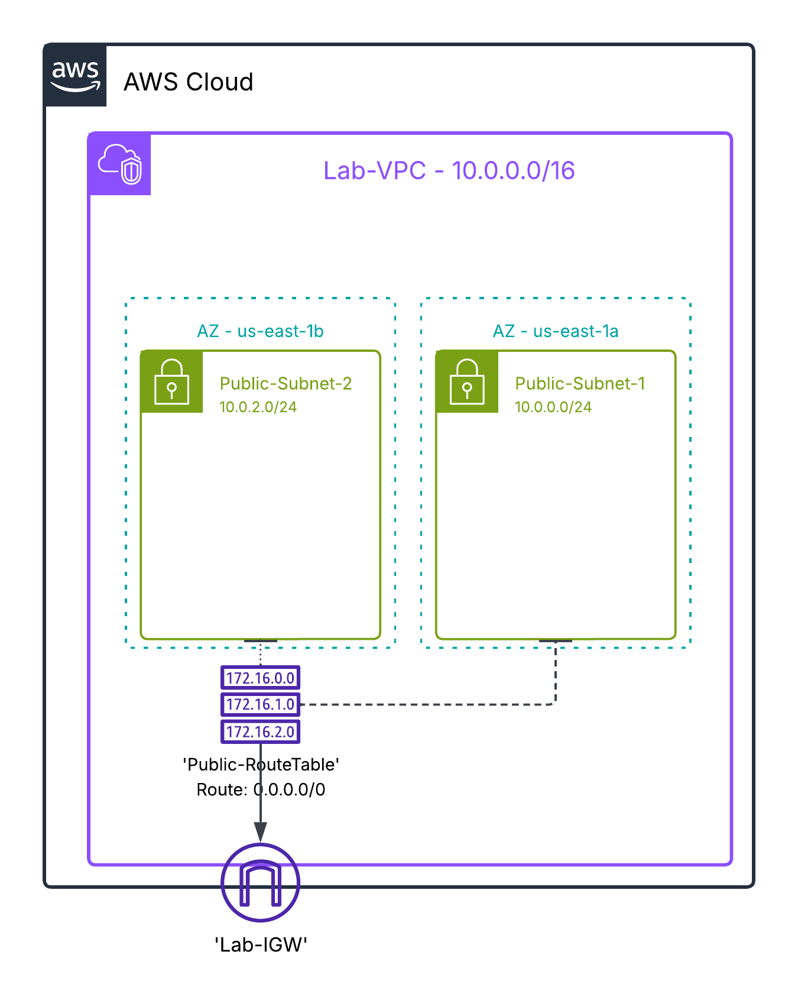
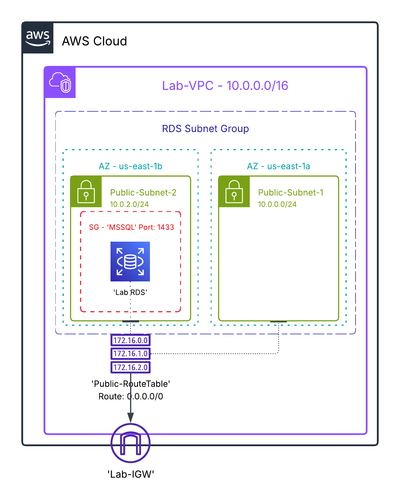

# RDS Instance Creation

**Description**: This project implements an **RDS Instance (SQL Server)** within a preconfigured VPC in AWS.  
The solution includes the creation of a **Security Group** and a **DB Subnet Group**, ending with the deployment of the database in Amazon RDS.

---

## 📌 Objective
Deploy a **Microsoft SQL Server instance on Amazon RDS**, leveraging an existing AWS infrastructure (VPC with subnets, route table, and internet gateway).

---

## 🏗️ Architecture

- Existing VPC: **Lab-VPC**
- Resources created in this project:
  - **Security Group** for RDS
  - **DB Subnet Group** for RDS
  - **RDS Instance** (SQL Server Express Edition)

 

---

## 🔐 Security Group Creation

1. Go to **VPC → Security Groups → Create security group**.
2. Configuration:
   - **Name**: `RDS-SecurityGroup`
   - **VPC**: `Lab-VPC`
3. Inbound rules:
   - All traffic from `0.0.0.0/0`
   - MSSQL (Port `1433`, TCP) from `0.0.0.0/0`

---

## 🌐 Subnet Group Creation

1. In the AWS Console, go to **RDS → Subnet Groups → Create DB Subnet Group**.
2. Configuration:
   - **Name**: `RDS-SubnetGroup`
   - **VPC**: `Lab-VPC`
   - **Availability Zones**: `us-east-1a`, `us-east-1b`
   - **Subnets**: Select the corresponding subnets

---

## 💾 RDS Instance Creation

1. Go to **RDS → Databases → Create Database**.
2. Configuration:
   - **Creation method**: `Standard create`
   - **Engine type**: `Microsoft SQL Server`
   - **Edition**: `SQL Server Express Edition`
   - **Template**: `Free Tier`
   - **DB identifier**: `lab-database`
   - **Master username**: `admin`
   - **Password**: `#LabDBase3!`
   - **Instance class**: `db.t3.micro`
   - **Storage**: `General Purpose SSD (gp2)`
   - **VPC**: `Lab-VPC`
   - **DB Subnet Group**: `RDS-SubnetGroup`
   - **Public access**: `Yes`
   - **Security group**: `RDS-SecurityGroup`
   - **Availability Zone**: `us-east-1b`

---

## ✅ Validation

- The **RDS instance** changes to the `Available` state.
- The **Endpoint** is retrieved for connection.
- Association with **VPC, Subnet Group, and Security Group** is confirmed.

 

---

## 📄 Programmatic Documentation (JSON)

The entire infrastructure is documented in JSON format for reference and versioning, as shown below:

- Complete VPC
- Subnets with CIDR and AZ
- Route Table with routes and associations
- Internet Gateway
- RDS Security Group with inbound/outbound rules
- DB Subnet Group
- RDS Instance with endpoint, port, subnets, SG, and storage

File: [`aws-infra.json`](./docs/aws-infra.json)

---

## 🎯 Results

- Successfully created an **Amazon RDS (SQL Server Express Edition)** instance accessible via port `1433`.
- The infrastructure is ready to be integrated with applications or external SQL clients.
- All configuration is versioned and documented in `aws-infra.json`.

---

## 📂 Repository Structure

This repository is organized as follows to keep all project resources in order:

- `README.md`: Explains the project objective, performed steps, and results.
- `diagrams/`: Contains architecture diagrams or infrastructure schemas.
- `screenshots/`: Stores screenshots of the AWS configuration for visual reference.
- `docs/aws-infra.json`: Complete documentation of the existing infrastructure in JSON format.
